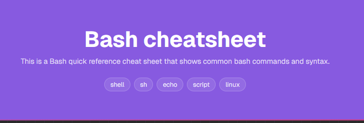
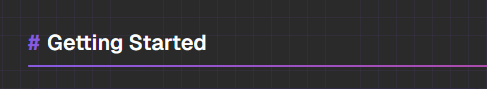
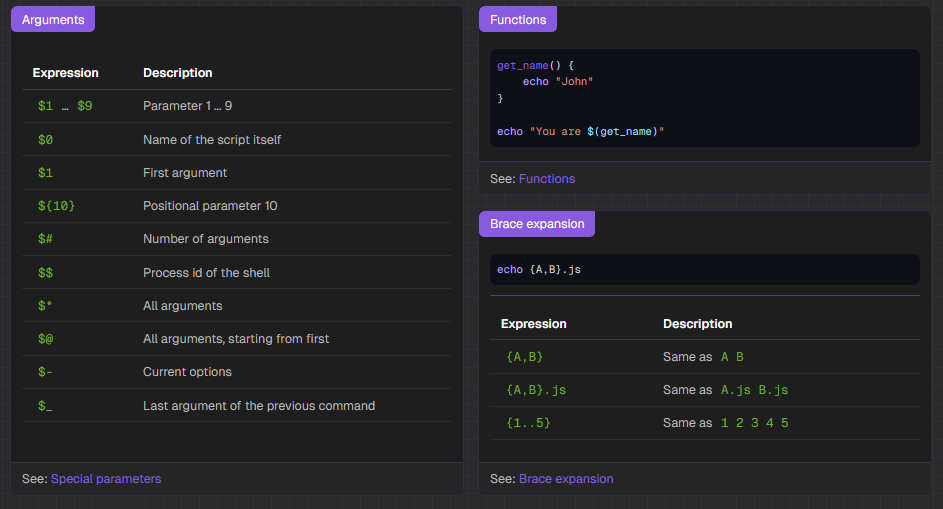
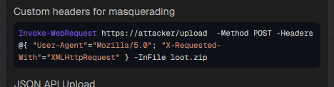
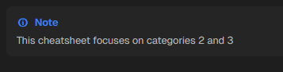
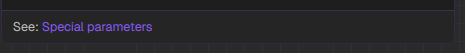

# EC Playbook

EC Playbook is a quick-reference knowledge base for offensive security practitioners. It is designed to surface concise, high-signal guidance that supports field work, training, and daily operations. The content is intentionally compact, consistent, and searchable so users can find the right command, concept, or workflow quickly.

## Intent

- Provide fast, reliable cheat sheets for offensive security workflows.
- Preserve operational knowledge in a clean, scannable format.
- Make it easy for contributors to add new content without fighting layout or styling.

## Credit / Inspiration

The layout and general presentation format are inspired by the GitHub project “reference” by Fechin. We do not use their branding or tooling. Please go check it out if you are interested in non-cyber security focused quick references. 

Reference repo: [Fechin/Reference](https://github.com/Fechin/reference)


## Contributing

We welcome contributions. The general flow:

1. Create or edit a markdown file in `content/`.
2. Keep sections and cards concise.
3. Use the formatting rules below so the UI renders correctly.
4. Submit a PR.

If you are adding a new cheatsheet, also add an icon in `public/assets/icons/` when available.

## Playbook Markdown Format

Each cheatsheet is a markdown file with front matter and a simple card layout. Plabooks are loaded dynamically using the 

### 1) Front Matter
At the top of every markdown file, a Front Matter section is required to tell the application how the cheatsheet should be labeled and styled. 

Required fields (common):

The following fields are required 

`title:` this is the title of the playbook. It will display in the card on the homepage and at the top of the cheatsheet

`date:` This is the date in which the playbook was created or modified. Its used to help inform the footer for recent playbook edits

`background:` this is the color of the card on the homepage. It must be given in [#XXXXXX] coloring format.

`tags:` Tags are used to assit the serach function with findings a category of sorts. They are also displayed at the top of the playbook's page

`categories:` This is the section in which the card on the main page will display. When creating a playbook please use an existing category. Multiple categories can be used if relevant to more than one. The card will display in both categories. Categories are case-sensitive. 

`intro:` This is the short blurb at the top of the playbook quickly describing what the playbook is for.

`plugins:` Right now the only supported plugin is `copyCode` but we will enable more as we build more. `copyCode` enables the copying of code from the code blocks within the playbook. 

In practice all these fields are 
```
---
title: Bash 
date: 2024-01-20
background: bg-[#2E7D32]
tags:
  - shell
  - sh
  - echo
  - script
  - linux
categories:
  - Programming
  - Command Line
intro: This is a Bash quick reference cheat sheet that shows common bash commands and syntax.
plugins:
  - copyCode
---
```
Example Screen



There are also two supported option fields

Optional fields:

- `icon`: filename in `public/assets/icons/` (e.g., `vim.svg`)
- `iconSize`: number (e.g., `30`)

`icon` is usually determined dynamically by the renderer by having the same name as the playbook. If the playbook does not have a `.svg` file that is exact in name it will default to the `file-text.svg` image unless `icon` is noted in the Front Matter. 

`iconSize` has a default value of 24. 

### 2) Sections and Cards

- `##` creates a section.
- `###` creates a card within that section.


Code Example:

```
## Getting Started

### Movement

| Shortcut {.shortcut} | Description |
| -------------------- | :---------- |
| [h] _|_ [j] _|_ [k] _|_ [l] | Left/Down/Up/Right |
```

Example Screen of a Section



Example Screen of a Card


### 3) Card Size / Layout

Each section uses a 3‑column grid and as many rows as needed. For example, 12 cards make 4 full rows; 13 cards make 5 rows, with the last row containing a single card (unless spans are used).

The grid uses a custom masonry-like layout that tries to keep card heights even within each row. If a card uses `row-span-2`, the grid attempts to match its height to the combined height of the two rows it spans.

To control the grid, use span classes on the card title:

```
### Motions {.row-span-2}
### Big Card {.col-span-2}
### Wide and Tall {.col-span-2 .row-span-2}
```
The following example is of a Grid where the card `Arguments` uses `{.row-span-2}` and the others do not have any span formatting attached. 

Code Example:
```
### Arguments {.row-span-2}
<content>

### Functions
<content>

### Brace expansion

```
Screenshot:



### 4) Tables

Tables are supported normally. 

If you wish to render keyboard shortcuts as keys, add `{.shortcut}` to the header and wrap keys in brackets:

```
| Shortcut {.shortcut} | Description |
| -------------------- | :---------- |
| [Ctrl] [C] | Copy |
| [Ctrl] [V] | Paste |
```

### 5) Code Blocks and Highlighting

Code blocks are supported normally through the use of the triple backtick (\`\`\`) for multi line code and syntax highlight or a single backtick (\`) for single in-line code highlighting 

If your code is too long and overflows the view window a scrollview is automatically established. If you wish to disbale the scrollview you can add `{.wrap}` to wrap the code. 

```
\```bash {.wrap}
curl -fsSL https://example.com/install.sh | bash
\```
```

Example of wrapped code




The code block's syntax highlighter supports all of the major lanugages like: 

- `c`
- `python`
- `cpp`
- `c#`
- `bash`
- `powershell`
  
it also support the following custom simplistic syntax highlighters

- `msf` (metasploit framework)
- `namp` (Network Mapper)
- `mkatz` (Mimikatz)

### 6) Inline Formatting

Similar to normal mardown various inline formatting functions are available
- To make Bold surround the word or phrase with `**<word or phrase>**` **Example**
- To make italic surround the word or phrase with `_<word or phrase>_` _Example_
- Links are supported with text formatting like `[text](https://example.com)`. [Example](emulatedcriminals.com)
- Lists are supported normally as well:
```
- item one
- item two

Note: Put a new line between the list and the line above it to force formatting to be closer together
```


### 7) Admonitions (Notes, Tips, Warnings)

Admonition are supported using the following pattern:

```
[!NOTE]
This is a note.
[!NOTE]
```

Supported types: `NOTE`, `TIP`, `IMPORTANT`, `WARNING`, `CAUTION`.

Example of Adonition



### 8) Card Footer

If the last non-empty line of a card starts with `See:`, it will render as a footer line:

```
See: [Ranges](#ranges)
```

Example of See footer:



## Contributors

- Dahvid “APT Big Daddy” Schloss
- Kris “elemental” Johnson
- Will "Ca$h" Im